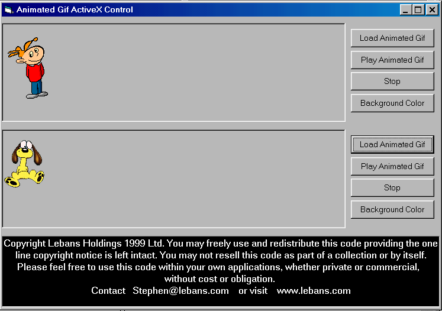



## Animated Gif Player ActiveX with Full Source in VB6

### Description

For the newest version that supports Local Color Tables and Transparency visit my Website here:

http://www.lebans.com/animatedgifplayer.htm

NEW! Animated Gif Player ActiveX Control with full source code. Written completely in VB6, no third party or external DLL's required. This is a complete rewrite of my earlier code to display Animated Gif's. Full featured and fully debugged!
 
### More Info
 
None Required. Includes a Class to call the API Windows File Dialog to get an Animated Gif filename.

The Animated Gif Player Class is wrapped within an ActiveX control for ease of use. It only uses 2 properties of the UserControl, BackColor and Device Context Handle. This means it is very easy to use switch these properties to that of a PictureBox control is you desire.

No apparent bugs or resource leaks. Tested extensively under Win95 and Win98. Tested opening more than 100 ANimated Gif's running continuously over a 24 hour period.

             |
---                |---
**Submitted On**   |2000-05-20 22:01:24
**By**             |[Stephen Lebans](https://github.com/Planet-Source-Code/PSCIndex/blob/master/ByAuthor/stephen-lebans.md)
**Level**          |Advanced
**User Rating**    |4.8 (133 globes from 28 users)
**Compatibility**  |VB 5\.0, VB 6\.0
**Category**       |[Custom Controls/ Forms/  Menus](https://github.com/Planet-Source-Code/PSCIndex/blob/master/ByCategory/custom-controls-forms-menus__1-4.md)
**World**          |[Visual Basic](https://github.com/Planet-Source-Code/PSCIndex/blob/master/ByWorld/visual-basic.md)
**Archive File**   |[CODE\_UPLOAD59525202000\.zip](https://github.com/Planet-Source-Code/stephen-lebans-animated-gif-player-activex-with-full-source-in-vb6__1-8224/archive/master.zip)

